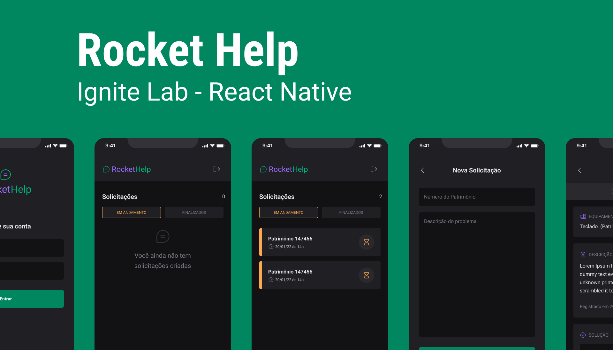

Aplicativo de solicitações de manutenção de equipamentos internos que pode ser usado em uma empresa.  

## Tecnologias:

- **[React Native](https://reactnative.dev/)**
- **[TypeScript](https://www.typescriptlang.org/)**
- **[Expo Bare Workflow](https://docs.expo.dev/bare/exploring-bare-workflow/)**


## Bibliotecas:

- **[Native Base](https://nativebase.io/)**
- **[React Native Firebase](https://rnfirebase.io/)**
- **[React Navigation](https://reactnavigation.org/)**
- **[Phosphor Icons](https://github.com/duongdev/phosphor-react-native)**
- **[React Native SVG Transformer](https://github.com/kristerkari/react-native-svg-transformer)**
- **[Expo Google Fonts](https://github.com/expo/google-fonts)**

## Aprendizado:

- **Expo Bare Workflow** que permite adicionar código nativo (Android e iOS) sem perder as facilidades do Expo e ainda utilizando **TypeScript** para melhorar a produtividade e até encontrar erros no código facilmente.
- **Native Base** foi o coração desta aplicação em relação a interface. É uma biblioteca de componentes que foi usada em lugar dos principais core componets.
- Como o React Native por padrão, não aceita svg, foi utilizado o **React Native SVG Transformer** para poder importar esses arquivos e usar com sintaxe de componente. Tipagem também foi acrescentado ao TypeScript para que ele reconheça a extensão svg.
- Quase finalizando, foi utilizado o ```expo prebuild```, neste ponto não era mais possível usar o aplicativo Expo Go (sem suporte ainda), devido a introdução do **Firebase** na qual utilizamos código nativo. Porém, ainda com a ajuda do Expo, podemos utilizar plugins para automatizar a implementação desses códigos.

## 🧪 Experimente:
 
NOTA: É necessário ter todo o ambiente de desenvolvimento configurado antes (como o android studio ou app Expo GO).
```bash 
git clone https://github.com/matheus-il/rockethelp.git
```
Depois execute as seguintes ações de linha de comando:
```bash
cd rockethelp
npm install
```
Em seguida execute estes comandos:
```bash
expo prebuild
expo run:android
```
OBS: Este processo pode levar um tempo.   
OBS²: Devido a falta de equipamento, não foi possível testar no iOS, mas você pode testar usando os mesmos comandos acima, porém substituindo ```run:android``` por ```run:ios```. Se houver erros, por favor, me informe.

## FAQ 

### *De onde saiu o design do app?*

O design foi desenvolvido pela equipe da Rocketseat no evento Ignite Lab. [Figma](https://www.figma.com/file/pSXn1mhn6adaaGC2wIl7pD/Rocket-Help---Ignite-Lab-(Community)?node-id=102%3A375)

### *Este projeto foi de evento?*

Sim! Organizado pela ela [Rocketseat](https://www.rocketseat.com.br/). O objetivo é aprender e conhecer o que há de mais moderno no frontend 💙.